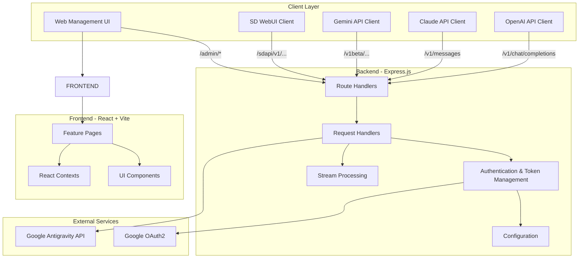
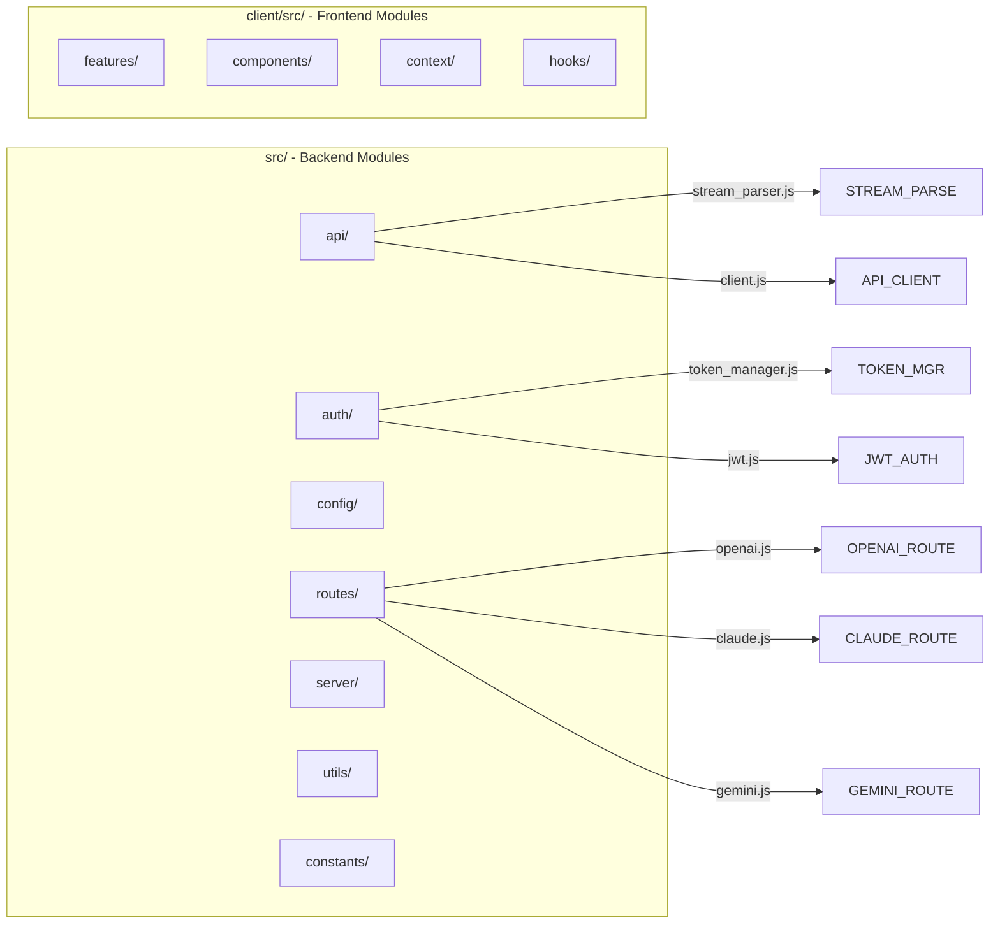

# Anti2API - Antigravity to OpenAI API Proxy Service

> **Last Updated:** 2025-12-31 15:27:42
> **Project Type:** Node.js (ES Modules) + React SPA
> **Node Version:** >= 18.0.0

## Project Vision

A high-performance proxy service that converts Google Antigravity API to multiple AI API formats (OpenAI, Claude, Gemini), featuring multi-account management, token rotation, streaming responses, and a modern React-based web management interface.

## Architecture Overview



## Module Structure



## Module Index

| Module | Path | Description |
|--------|------|-------------|
| **Server Entry** | `src/server/index.js` | Express app setup, middleware, routes |
| **API Client** | `src/api/client.js` | Antigravity API calls, model list caching |
| **Stream Parser** | `src/api/stream_parser.js` | SSE stream parsing with object pool |
| **Token Manager** | `src/auth/token_manager.js` | Multi-account rotation, token refresh |
| **Token Store** | `src/auth/token_store.js` | Async file-based token persistence |
| **JWT Auth** | `src/auth/jwt.js` | Admin authentication |
| **OAuth Manager** | `src/auth/oauth_manager.js` | OAuth flow handling |
| **Quota Manager** | `src/auth/quota_manager.js` | Model quota caching |
| **Config** | `src/config/config.js` | Configuration loader (JSON + env) |
| **Routes** | `src/routes/*.js` | API endpoints (OpenAI, Claude, Gemini, SD, Admin) |
| **Handlers** | `src/server/handlers/*.js` | Request processing logic |
| **Converters** | `src/utils/converters/*.js` | Format conversion (OpenAI/Claude/Gemini) |
| **Antigravity Requester** | `src/AntigravityRequester.js` | Native subprocess HTTP client |
| **Frontend** | `client/src/` | React SPA with Vite |

## Key Entry Points

- **Backend Entry:** `src/server/index.js`
- **Frontend Entry:** `client/src/main.jsx`
- **Configuration:** `.env` + `config.json`
- **Token Storage:** `data/accounts.json`
- **Build Scripts:** `scripts/build.js`, `scripts/oauth-server.js`

## Development Commands

```bash
# Production
npm start                    # Start backend (with GC)
npm run start:no-gc          # Start without GC optimization

# Development
npm run dev                  # Backend + Frontend with hot reload
npm run dev:backend          # Backend only with watch
npm run dev:client           # Frontend only

# Build
npm run build:win            # Windows x64
npm run build:linux          # Linux x64
npm run build:linux-arm64    # Linux ARM64
npm run build:macos          # macOS x64
npm run build:macos-arm64    # macOS ARM64
npm run build:all            # All platforms

# Utilities
npm run login                # OAuth login to get token
npm run refresh              # Refresh tokens
```

## API Endpoints

| Endpoint | Format | Description |
|----------|--------|-------------|
| `POST /v1/chat/completions` | OpenAI | Chat completions |
| `GET /v1/models` | OpenAI | List models |
| `POST /v1/messages` | Claude | Claude messages API |
| `POST /v1beta/models/:model:generateContent` | Gemini | Gemini generate (non-streaming) |
| `POST /v1beta/models/:model:streamGenerateContent` | Gemini | Gemini generate (streaming) |
| `GET /v1beta/models` | Gemini | List Gemini models |
| `POST /sdapi/v1/txt2img` | SD WebUI | Text to image |
| `POST /sdapi/v1/img2img` | SD WebUI | Image to image |
| `GET /admin/*` | Internal | Admin management |

## Configuration

### Environment Variables (.env)
```env
API_KEY=sk-your-key           # Required: API authentication
ADMIN_USERNAME=admin          # Required: Admin login
ADMIN_PASSWORD=password       # Required: Admin password
JWT_SECRET=secret             # Required: JWT signing key
PROXY=http://127.0.0.1:7890   # Optional: Proxy server
SYSTEM_INSTRUCTION=...        # Optional: Default system prompt
IMAGE_BASE_URL=...            # Optional: Base URL for images
```

### Base Configuration (config.json)
```json
{
  "server": { "port": 8046, "host": "0.0.0.0", "maxRequestSize": "500mb", "heartbeatInterval": 15000, "memoryThreshold": 50 },
  "rotation": { "strategy": "round_robin", "requestCount": 50 },
  "defaults": { "temperature": 1, "topP": 1, "topK": 50, "maxTokens": 32000, "thinkingBudget": 16000 },
  "cache": { "modelListTTL": 3600000 },
  "api": { "url": "https://daily-cloudcode-pa.sandbox.googleapis.com/v1internal:streamGenerateContent?alt=sse", "modelsUrl": "...", "noStreamUrl": "..." },
  "other": { "timeout": 300000, "retryTimes": 3, "skipProjectIdFetch": false, "useNativeAxios": false, "useContextSystemPrompt": true, "passSignatureToClient": false }
}
```

## Token Rotation Strategies

| Strategy | Behavior |
|----------|----------|
| `round_robin` | Switch token after each request |
| `quota_exhausted` | Switch only when quota runs out |
| `request_count` | Switch after N requests (configurable) |

## Global Standards

### Code Style
- ES Modules (import/export)
- Async/await for all async operations
- JSDoc comments for public functions
- English comments in code

### Error Handling
- Use `createApiError()` for API errors
- Centralized error handler middleware
- Graceful shutdown handling

### Memory Management
- Object pooling for stream chunks
- Dynamic memory thresholds
- Automatic GC triggering under pressure
- Memory pressure monitoring (LOW/MEDIUM/HIGH/CRITICAL)

### Logging
- Use `logger` from `src/utils/logger.js`
- Request logging with timing
- Structured log levels (info, warn, error)

## Security Notes

- All API endpoints require API key authentication
- Admin routes require JWT authentication
- Tokens stored locally in `data/accounts.json`
- Never commit `.env` or `data/` to version control
- JWT token auto-expires
- Privacy mode for sensitive information

## Performance Features

- **Heartbeat Mechanism**: Prevents Cloudflare timeout (15s interval)
- **Model List Caching**: Reduces API requests (1-hour TTL)
- **Object Pool Reuse**: 50%+ reduction in temp object creation
- **Memory Optimization**: From 100MB+ to 50MB+ usage
- **Pre-compiled Regex**: Avoids repeated compilation
- **Dynamic Memory Threshold**: Auto-calculated based on config
- **Native Requester**: Optional Go-based HTTP client for better performance

---

## Navigation

- [Backend API Module](src/api/CLAUDE.md)
- [Authentication Module](src/auth/CLAUDE.md)
- [Routes Module](src/routes/CLAUDE.md)
- [Server Module](src/server/CLAUDE.md)
- [Config Module](src/config/CLAUDE.md)
- [Constants Module](src/constants/CLAUDE.md)
- [Utilities Module](src/utils/CLAUDE.md)
- [Scripts](scripts/CLAUDE.md)
- [Frontend Client](client/CLAUDE.md)
