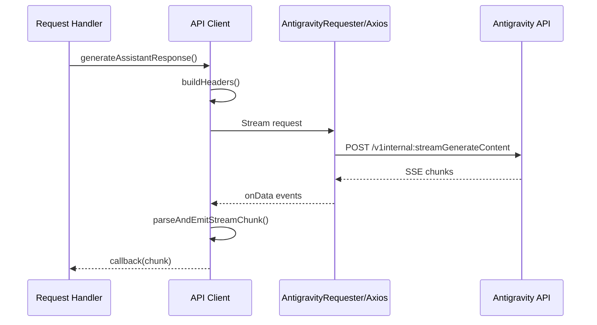

# API Module

> 📍 **Location:** `src/api/`
> 🔗 **Parent:** [Project Root](../../CLAUDE.md)

## Purpose

Core API communication layer handling all interactions with the Google Antigravity API, including streaming and non-streaming responses, model list caching, and memory-optimized stream parsing.

## Files

| File | Description |
|------|-------------|
| `client.js` | Main API client - handles requests to Antigravity API |
| `stream_parser.js` | SSE stream parsing with object pooling |

## Key Components

### client.js

**Exports:**
- `generateAssistantResponse(requestBody, token, callback)` - Streaming response
- `generateAssistantResponseNoStream(requestBody, token)` - Non-streaming response
- `getAvailableModels()` - Get model list (cached)
- `getModelsWithQuotas(token)` - Get models with quota info
- `generateImageForSD(requestBody, token)` - SD WebUI image generation
- `closeRequester()` - Cleanup requester resources
- `clearModelListCache()` - Force clear model cache

**Features:**
- Dual HTTP client support (AntigravityRequester / axios fallback)
- Smart model list caching with dynamic TTL based on memory pressure
- Automatic token refresh on 403 errors
- Default model list fallback when API unavailable

### stream_parser.js

**Features:**
- Object pool for chunk reuse (50%+ memory reduction)
- Line buffer for efficient stream splitting
- Pre-compiled regex patterns
- Memory cleanup registration with memoryManager

## Data Flow



## Dependencies

- `../auth/token_manager.js` - Token retrieval
- `../config/config.js` - API configuration
- `../utils/memoryManager.js` - Memory pressure monitoring
- `../utils/httpClient.js` - HTTP request utilities
- `../AntigravityRequester.js` - Native requester (optional)

## Configuration

```javascript
config.api.url         // Streaming endpoint
config.api.noStreamUrl // Non-streaming endpoint
config.api.modelsUrl   // Models list endpoint
config.api.host        // API host header
config.api.userAgent   // User agent string
config.cache.modelListTTL // Cache TTL (dynamic)
```

## Error Handling

- 403 errors: Token auto-disabled, switch to next
- Context exceeded: Specific error message
- Network errors: Wrapped in ApiError

---

*Last updated: 2025-12-27*
