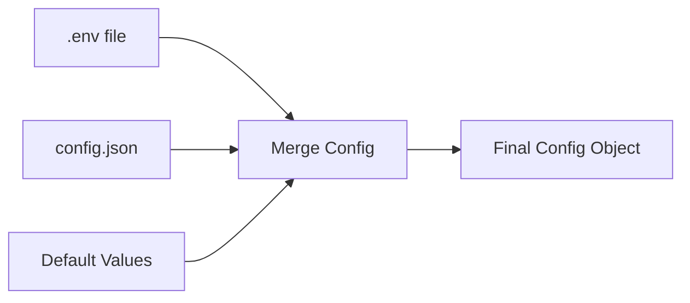

# Config Module

> 📍 **Location:** `src/config/`
> 🔗 **Parent:** [Project Root](../../CLAUDE.md)

## Mục đích

Quản lý cấu hình ứng dụng từ nhiều nguồn (file JSON, biến môi trường), hỗ trợ hot reload và validation.

## Files

| File | Mô tả |
|------|-------|
| `config.js` | Config loader chính - merge JSON + env variables |
| `init-env.js` | Environment variable initialization và validation |

## Key Components

### config.js

**Exports:**
- `default` - Merged config object
- `getConfigJson()` - Get original config.json content
- `reloadConfig()` - Hot reload configuration

**Config structure:**
```javascript
{
  server: {
    port: number,
    host: string,
    maxRequestSize: string,
    heartbeatInterval: number,
    memoryThreshold: number
  },
  rotation: {
    strategy: 'round_robin' | 'quota_exhausted' | 'request_count',
    requestCount: number
  },
  api: {
    url: string,
    modelsUrl: string,
    noStreamUrl: string,
    host: string,
    userAgent: string
  },
  defaults: {
    temperature: number,
    topP: number,
    topK: number,
    maxTokens: number,
    thinkingBudget: number
  },
  cache: {
    modelListTTL: number
  },
  other: {
    timeout: number,
    retryTimes: number,
    skipProjectIdFetch: boolean,
    useNativeAxios: boolean,
    useContextSystemPrompt: boolean,
    passSignatureToClient: boolean
  },
  security: {
    apiKey: string,
    adminUsername: string,
    adminPassword: string,
    jwtSecret: string
  },
  proxy: string | null,
  systemInstruction: string | null,
  imageBaseUrl: string | null
}
```

### init-env.js

**Trách nhiệm:**
- Load `.env` file
- Validate required env variables
- Generate random credentials if missing
- Display auto-generated credentials on startup

**Auto-generation:**
```javascript
// If not configured in .env:
API_KEY         → Random string (sk-xxxxx)
ADMIN_USERNAME  → Random string
ADMIN_PASSWORD  → Random string
JWT_SECRET      → Random UUID
```

## Config Loading Strategy

**Priority (high to low):**
1. Environment variables (`.env`)
2. `config.json` file
3. Default values

**Loading process:**


## Hot Reload

**Supported:**
- `config.json` changes
- Rotation strategy updates
- Default parameter changes
- Timeout và retry settings

**Not supported (requires restart):**
- Server port/host
- Security credentials
- API endpoints

**Usage:**
```javascript
import { reloadConfig } from '../config/config.js';

// Reload configuration
const newConfig = reloadConfig();
```

## Environment Variables

### Required

| Variable | Mô tả | Example |
|----------|-------|---------|
| `API_KEY` | API authentication key | `sk-your-api-key` |
| `ADMIN_USERNAME` | Admin username | `admin` |
| `ADMIN_PASSWORD` | Admin password | `secure-password` |
| `JWT_SECRET` | JWT signing secret | `your-jwt-secret-key` |

### Optional

| Variable | Mô tả | Default |
|----------|-------|---------|
| `PROXY` | HTTP proxy URL | `null` |
| `SYSTEM_INSTRUCTION` | Default system prompt | `null` |
| `IMAGE_BASE_URL` | Base URL for images | `null` |

## Config Files

### config.json

**Location:** Project root

**Purpose:** Base configuration for server, API, defaults

**Example:**
```json
{
  "server": {
    "port": 8046,
    "host": "0.0.0.0",
    "maxRequestSize": "500mb",
    "heartbeatInterval": 15000,
    "memoryThreshold": 50
  },
  "rotation": {
    "strategy": "round_robin",
    "requestCount": 50
  },
  "defaults": {
    "temperature": 1,
    "topP": 1,
    "topK": 50,
    "maxTokens": 32000,
    "thinkingBudget": 16000
  }
}
```

### .env

**Location:** Project root

**Purpose:** Sensitive credentials and optional settings

**Example:**
```env
API_KEY=sk-your-key
ADMIN_USERNAME=admin
ADMIN_PASSWORD=password123
JWT_SECRET=your-jwt-secret
PROXY=http://127.0.0.1:7890
SYSTEM_INSTRUCTION=You are a helpful assistant
IMAGE_BASE_URL=https://your-domain.com
```

## Dependencies

- `dotenv` - Environment variable loading
- `../utils/paths.js` - Path resolution
- `../utils/logger.js` - Logging

## Error Handling

**Missing config.json:**
- Uses default values
- Logs warning
- Continues startup

**Invalid JSON:**
- Throws error
- Stops startup
- Logs parse error details

**Missing .env:**
- Auto-generates credentials
- Displays generated values
- Saves to `.env`

---

*Last updated: 2025-12-31*
