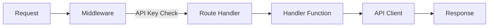

# Routes Module

> 📍 **Location:** `src/routes/`
> 🔗 **Parent:** [Project Root](../../CLAUDE.md)

## Purpose

Express route definitions for all API endpoints. Each route file handles a specific API format (OpenAI, Claude, Gemini, SD WebUI) or admin functionality.

## Files

| File | Endpoints | Description |
|------|-----------|-------------|
| `openai.js` | `/v1/chat/completions`, `/v1/models` | OpenAI-compatible API |
| `claude.js` | `/v1/messages` | Anthropic Claude-compatible API |
| `gemini.js` | `/v1beta/models/:model:*` | Google Gemini-compatible API |
| `sd.js` | `/sdapi/v1/*` | Stable Diffusion WebUI compatible |
| `admin.js` | `/admin/*` | Admin management endpoints |

## Route Details

### openai.js
```javascript
GET  /v1/models           // List available models
POST /v1/chat/completions // Chat completion (streaming/non-streaming)
```

### claude.js
```javascript
POST /v1/messages         // Claude messages API
```

### gemini.js
```javascript
POST /v1beta/models/:model:generateContent       // Non-streaming
POST /v1beta/models/:model:streamGenerateContent // Streaming
GET  /v1beta/models                              // List models
GET  /v1beta/models/:model                       // Model details
```

### sd.js
```javascript
POST /sdapi/v1/txt2img    // Text to image generation
POST /sdapi/v1/img2img    // Image to image generation
GET  /sdapi/v1/sd-models  // List SD models
GET  /sdapi/v1/samplers   // List samplers
GET  /sdapi/v1/options    // Get options
```

### admin.js
```javascript
POST /admin/login         // Admin authentication
GET  /admin/tokens        // List tokens
POST /admin/tokens        // Add token
PUT  /admin/tokens/:id    // Update token
DELETE /admin/tokens/:id  // Delete token
GET  /admin/config        // Get configuration
PUT  /admin/config        // Update configuration
POST /admin/oauth/...     // OAuth flow endpoints
```

## Request Flow



## Middleware Chain

1. **CORS** - Cross-origin support
2. **JSON Parser** - Body parsing with size limit
3. **Static Files** - Public directory serving
4. **Request Logging** - Timing and path logging
5. **API Key Validation** - For `/v1/` and `/v1beta/` routes
6. **Route Handlers** - Specific endpoint logic
7. **Error Handler** - Centralized error response

## Dependencies

- `../server/handlers/*.js` - Request processing logic
- `../api/client.js` - API calls
- `../auth/token_manager.js` - Token management
- `../auth/jwt.js` - JWT middleware

---

*Last updated: 2025-12-27*
